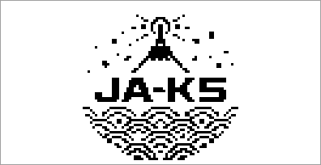
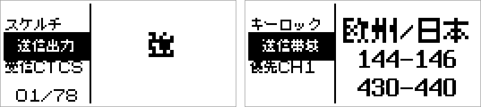
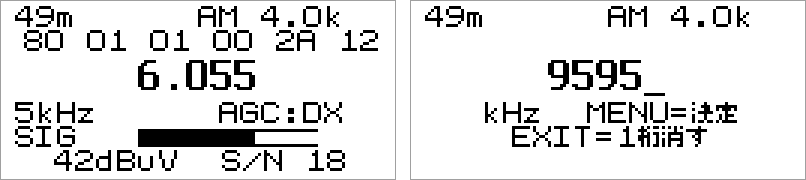
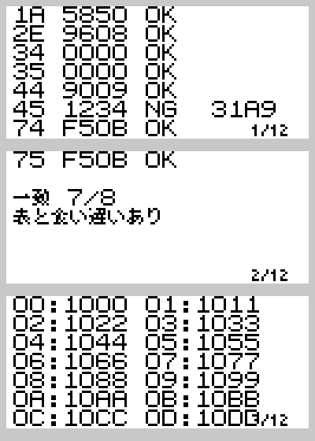

<p align="center">
  
</p>

<p align="center">
  <b>Quansheng UV-K5(8) V3 / UV-K1 を日本語で使うためのファームウェア</b>
</p>

[F4HWN Edition Fusion](https://github.com/armel/uv-k1-k5v3-firmware-custom) v5.9.0 を土台に、
UI の日本語化と、SI4732 を載せた機体での短波受信を足しました。

もともとは「メニューが英語で操作が覚えられない」という個人的な不満から始めたものです。
そのうち BK1080 を剥がして SI4732 を載せる改造に手を出し、短波が聞けるようになり、
ついでに BK4829 のレジスタを実機から吸い出して Beken のデータシートを検証する、
というところまで来ました。



> [!CAUTION]
> **この無線機は日本では送信できません。** 技適を受けていないため、送信すると電波法違反です。
> 受信専用機として使ってください。誤送信が怖い場合は、隠しメニュー（PTT ＋ 上サイドキーを
> 押しながら電源 ON）の「送信帯域」→「送信 全面禁止」を設定しておくと安全です。
> なお受信は自由ですが、電波法59条により傍受した内容を漏らしたり窃用することは禁じられています。

## 対応機種

PY32F071 を積んだ **UV-K5(8) V3 と UV-K1 だけ**です。
旧来の DP32G030 機（UV-K5 V1 / V2 / K6）に書き込むと文鎮化します。

見分け方は簡単で、USB-C を PC につないで COM ポートが生えれば V3。
充電しか始まらなければ旧機種です。

書き込む前に [UV Studio](https://armel.github.io/uvstudio/#dump-calib) で
キャリブレーションデータをバックアップしておいてください。上流と同じく無保証です。

## どちらのバイナリを使うか

[Releases](../../releases) に2つ置いてあります。

- `JA-K5_vX.X_stock.bin` — ハードウェアを一切いじっていない機体用
- `JA-K5_vX.X_si4732.bin` — BK1080 を外して SI4732 を載せた機体用

改造していない機体に si4732 版を書いても壊れませんが、短波画面で
「モジュールが見つかりません」と出るだけで、代わりに FM 放送受信と Fox Hunt、
RF LOG を失います。改造していないなら stock 版です。

## 日本語 UI



メニュー名 95 項目、設定値 150 行、カテゴリ名、サイドキーの機能名を日本語にしました。

フォントは門真なむ氏の[美咲ゴシック 8x8](https://littlelimit.net/misaki.htm)。
ファームウェアが実際に使う文字だけを BDF から抜き出して埋め込んでいるので、
日本語化のコストは 3.8 KB で済んでいます。

描画は `UI_PrintString` 系を UTF-8 対応にしただけなので、ASCII の描画結果は
上流と 1 ドットも変わりません（`ENABLE_LANG_JA=OFF` でビルドするとバイナリが
ほぼ一致することを確認しています）。実装の詳細は [README_JA.md](README_JA.md) に。

上下キーの向きも UV-K5(8) 向けに固定してあります。上流は初期値が UV-K1 向けなので
K5(8) では周波数の増減が逆になり、しかも直すための `SetNav` は隠しメニューにあって、
`ENABLE_FEAT_F4HWN_RESCUE_OPS` が無効なビルドでは設定が保存されません。

## 短波受信



BK1080 のフットプリントに SI4732-A10 モジュールを載せた機体で、LW / MW / SW と
FM 放送を受信します。IOTCU V9.1B 改造基板で動作確認済みです。

受信できるのは **150 kHz – 23 MHz** と **FM 64–108 MHz**。
26.1 – 64 MHz と 108 MHz 以上は SI4732 の守備範囲外で、そこは従来どおり BK4829 が担当します。
「HF が増える」改造であって「HF から VHF まで連続」ではありません。

上限が 23 MHz なのはデータシートではなく AN332 の都合です。`AM_TUNE_FREQ` の項に
「149 to 23000 kHz」と書かれていて、データシートの「SW 2.3–26.1 MHz」と食い違っています。
実際にコマンドが受け付けないので、12m / 11m / 10m は同調できません。

### 操作

| キー | 短押し | 長押し |
|---|---|---|
| 0–9 | 周波数入力（kHz、6桁で自動確定） | |
| MENU | 確定 / AM→LSB→USB | 前のバンド |
| ✱ | ステップ（10 Hz〜10 kHz） | 次のバンド |
| F | 帯域幅（6.0k〜1.0k の7段） | 感度 |
| ↑ / ↓ | 同調 | スキャン |
| EXIT | 1桁消す / 画面を出る | |

周波数を打てば、聞ける方の石が自動で選ばれます。メイン画面で BK4829 の下限より低い
周波数を入れると SI4732 に渡って画面が切り替わり、逆に短波画面で 23 MHz より上を
入れると無線機側に戻ります。

感度は AN332 のコマンド 0x48（`AM_AGC_OVERRIDE`）で AGC のゲインインデックスを
0〜37 に固定するもので、`AUTO` / `DX` / `NOR` / `LOC` / `ATT` の5段です。
ホイップなら `AUTO` で問題ありませんが、外にアンテナを張ると強い中波局で
フロントエンドが飽和するので、そこで効きます。

スキャンはチップ内蔵の `AM_SEEK_START` / `FM_SEEK_START` を使います。
自前で掃引すると 1 点あたり 80 ms の同調待ちを払うことになるので、
チップに歩かせたほうが速くて確実です。

### バンド

日本で実際に何か聞こえる区切りにしてあります。36 バンド。

放送は LW / MW（9 kHz ステップ）/ 120m / 90m / 75m / 60m / 49m / 41m / 31m / 25m /
22m / 19m / 16m / 13m。ラジオ NIKKEI の3波が各バンドの初期周波数になっているので、
75m を選べば 3925 kHz、49m なら 6055 kHz、31m なら 9595 kHz にいます。

アマチュアは日本の割当で 3.5 / 7 / 10 / 14 / 18 / 21 MHz。
海上は 4 / 6 / 8 / 12 / 16 MHz 帯、洋上管制は 5628 / 6655 / 8951 / 11330 / 13300 kHz を
含む5バンド。気象庁の気象 FAX（JMH）は 3622.5 / 7795 / 13988.5 kHz を専用の狭いバンドで。
WWV / WWVH 用に 9990–10010 kHz も置いてあります。

### SSB

SSB パッチ（約 15.8 KB）は SPI フラッシュから 8 バイトずつストリーミングする実装なので、
MCU 側のフラッシュも RAM も消費しません。ただし**パッチをフラッシュに書き込む手段が
まだありません**。パッチが無い状態で SSB に入るとチップが止まるため、LSB / USB を
選んでも自動的に AM に戻ります。

## BK4829 のレジスタを実機で読む



BK4829 の全 128 レジスタを本体画面に表示します。1〜2 ページ目では、ファームウェアが
一度も書き込まない 8 本のレジスタをデータシートの既定値と照合して OK / NG を出します。

これは Beken の「BK4829 Registers Table」が
[BK4819 の文書の使い回しではないか](https://github.com/armel/uv-k1-k5v3-firmware-custom/discussions/36)
という疑いを実機で確かめるために作ったものです。結果は 8/8 一致、さらに `REG_00` が
`0x4829` を返すことが分かりました（表にある `48x9` はファミリー共通の表記だったわけです）。

CAT 経由で読む [`tools/bk4829/dump_regs.py`](tools/bk4829/dump_regs.py) も入れてあります。

## 起動ロゴと起動音

上流の起動ロゴは SPI フラッシュの `0x011008` から読み込む作りで、書き換えるには
フラッシュライタが要ります。ここでは 1 KB の定数としてファームウェアに同梱したので、
書き込みツールなしでロゴが変わります。

`起動画面 → SOUND` は上流では音が鳴りません（画面を消すだけで、対応する音が
実装されていない）。D5→F#5→A5→D6 の上昇アルペジオを足しました。
`BK4819_PlayToneRaw()` は任意の周波数を取るので、音階は `App/audio.c` の4行の表だけで決まります。

## ハードウェア改造

短波を聞くには BK1080 を外して SI4732 モジュールを載せる必要があります。
IOTCU V9.1B の中国語インストール手順書を訳したものが
[docs-ja/iotcu-v91b-guide-ja.md](docs-ja/iotcu-v91b-guide-ja.md) にあります。

8 パッドの向きを間違えると電源が短絡して基板が焼けます。実際に 1 台壊しました。
三端子レギュレータと R500（0.5Ω の電流検出抵抗）が触れないほど熱くなったら、
すぐ電源を切ってモジュールを外してください。はんだ付けの前に、GND パッドがどれかを
テスターで確認しておくと安全です。

外装の LED 穴を拡げて SMA 座を通すとき、基板側の旧 LED パッドに絶縁テープを貼らないと
SMA の芯線が短絡して ESD ダイオードとインダクタを壊します。手順書にも明記されています。

## ビルド

```sh
cmake --preset SI4732Ja && cmake --build build/SI4732Ja   # 短波あり
cmake --preset FusionJa  && cmake --build build/FusionJa  # 短波なし、全部入り
cmake --preset CustomJa  && cmake --build build/CustomJa  # 軽量版
```

`arm-none-eabi-gcc` と `cmake`、`ninja` が必要です。上流同梱の `./compile-with-docker.sh` も使えます。
タグを打つと GitHub Actions が両方ビルドして Release に添付します。

`SI4732Ja` は `FusionJa` に短波受信とレジスタ表示を足し、その分の容量を作るために
Fox Hunt と RF LOG を落とした構成です。

追加したビルドオプションは4つ。

| オプション | 内容 |
|---|---|
| `ENABLE_LANG_JA` | 日本語 UI |
| `ENABLE_FIXED_NAV_K5` | 上下キーの向きを UV-K5(8) 固定 |
| `ENABLE_SI4732` | SI4732 による短波受信 |
| `ENABLE_REG_DUMP_SCREEN` | BK4829 レジスタを本体画面に表示 |

フラッシュは 118 KB しかないので、常に残量との戦いになります。

| 構成 | 使用量 | 空き |
|---|---|---|
| SI4732Ja | 113,164 B | 7,668 B |
| FusionJa | 117,772 B | 3,060 B |
| CustomJa | 74,024 B | 46,808 B |

FusionJa は 97% です。これ以上何か足すなら、何かを落とすことになります。

## 書き込み

[UV Studio](https://armel.github.io/uvstudio/) をブラウザで開いて `.bin` を選ぶだけです。
PTT を押しながら電源 ON でブートローダに入ります。
CHIRP を使う場合は、上流のリリースに同梱されている v5.9.0 用のドライバが必要です。

## まだ直っていないこと

- **S/N が常に 0 と表示される。** RSQ の応答バイト位置は AN332 で確認済み
  （RESP4 = RSSI、RESP5 = SNR）で、コードは正しい位置を読んでいます。
  チップが 0 を返している側の問題で、原因は掴めていません。
  切り分け用に RSQ の生 6 バイトを画面最下行に出しています
- **SSB パッチの書き込み手段がない**（上記）
- **アプリ側の USB CAT が応答しない。** ブートローダは応答するので書き込みはできますが、
  起動後のシリアル通信が繋がりません
- **Bluetooth はファームウェアから制御できません。** IOTCU V9.1B の Bluetooth は
  基板上でキー検出線を直接見ている独立したチップで、操作は PTT の1回／2回／3回押しだけです。
  IOTCU 公式ファームウェアを逆アセンブルしても、`AT+` 等の制御コードは1つも見つかりませんでした

## クレジット

このファームウェアは積み重ねの上に成り立っています。機能の大半は上流のものです。

- [DualTachyon](https://github.com/DualTachyon/uv-k5-firmware) — UV-K5 のオープンソースファームウェアを最初に公開
- [egzumer](https://github.com/egzumer/uv-k5-firmware-custom) — 機能を大きく拡張したカスタム版
- [armel / F4HWN](https://github.com/armel/uv-k5-firmware-custom) — F4HWN Edition
- [armel / F4HWN と muzkr](https://github.com/armel/uv-k1-k5v3-firmware-custom) — PY32F071 への移植。このリポジトリの直接の派生元

上流の README は [README_F4HWN.md](README_F4HWN.md) にそのまま残してあります。
本体の「本体情報」画面には派生元のバージョン（`F4HWN 5.9.0`）が出ます。

## ライセンス

Apache License 2.0。DualTachyon 以来の著作権表示を引き継いでいます。
詳細は [LICENSE](LICENSE) と [NOTICE](NOTICE) を。

同梱の美咲フォント（`tools/lang_ja/misaki_gothic.bdf` と、そこから生成した
`App/font_ja.c`）は Apache 2.0 の対象外で、それ自身のライセンスで再配布しています。

> These fonts are free softwares. Unlimited permission is granted to use, copy,
> and distribute it, with or without modification, either commercially and
> noncommercially. THESE FONTS ARE PROVIDED "AS IS" WITHOUT WARRANTY.
>
> — 美咲フォント (c) 門真なむ https://littlelimit.net/misaki.htm
